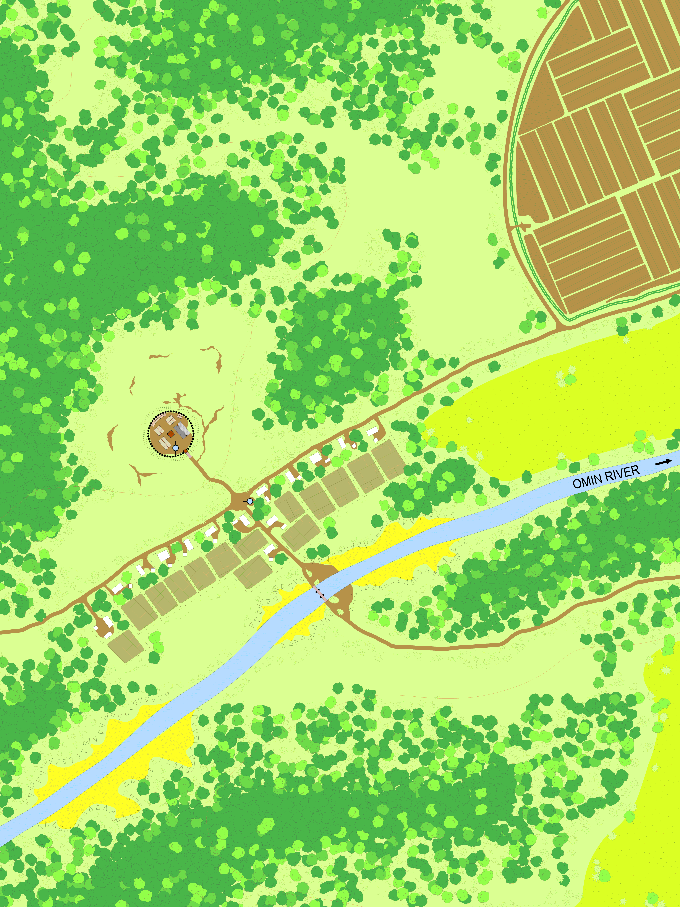
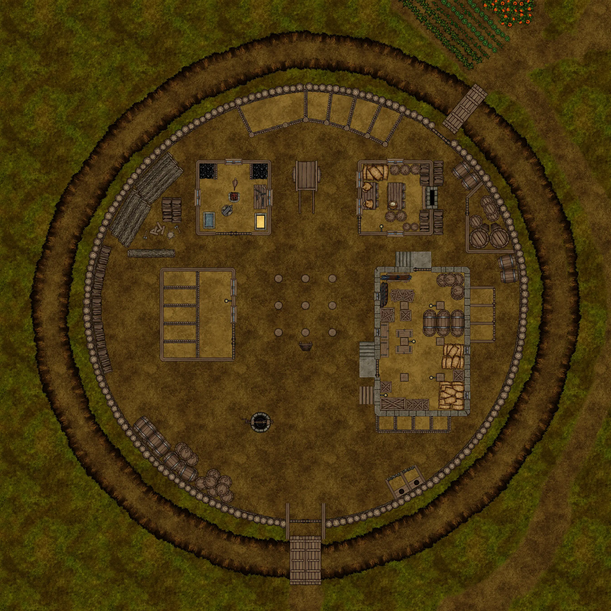
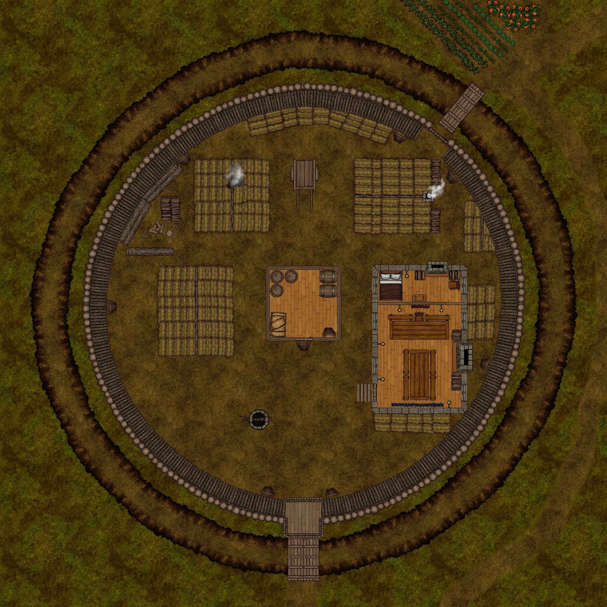
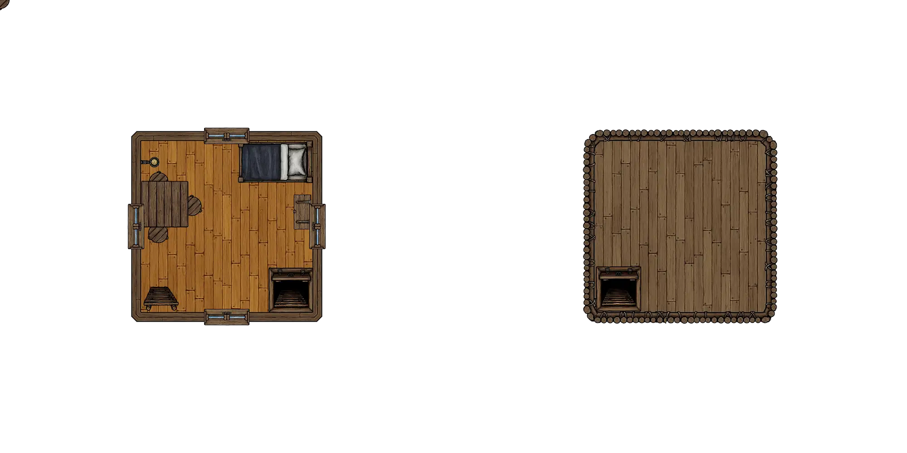

# HârnWorld Location Module: Emerule Manor

[)].download_count&url=https://api.github.com/repos/toastygm/hm-loc-emerule/releases/latest&color=green)](https://github.com/toastygm/hm-loc-emerule/releases/latest)

Emerule Manor is a "Location Module" for the Foundry VTT system. This location module
is designed to depict the Emerule Manor in the Fethael Hundred of the Kingdom of Kaldor, on
the island of Hârn in the [HârnWorld](https://columbiagames.com/harnworld/) fantasy
setting; however, this manor could be adapted to exist anywhere in any fantasy setting.

Although designed for use with the [HârnMaster](https://foundryvtt.com/packages/hm3)
system, this module is mostly system-agnostic.  Detailed descriptions of the actors
has been provided in journal entries to facilitate conversion to other game systems.

Emerule is a sleepy manor on the edge of the Chyle forest, favored hunting lodge of
the Baron Indama, and home to the Baron's troblesome daughter. The manor has been
plagued by recent attacks from a local outlaw gang.

# Maps

The original maps from this work have been used as inspiration, and new maps have been
designed specifically to meet the requirements of the VTT environment.  The following
maps are part of this module.

## Emerule Village

Map of Emerule Village, including the manor.

## Emerule Manor

Ground Level.

Second Level.

Third Level and Roof.

# Credits

This module is made possible by the hard work of HârnWorld fans,
and is provided at no cost. This work is an adaptation of the article for
Emerule Manor described in [Fethael Hundred Manors](https://www.lythia.com/fethael-hundred/manors.html)
available at the HârnWorld fan site [Lythia.com](https://www.lythia.com/).

**Writer:** Joe Adams

**Original Maps:** George Kelln

**Heraldry:** Matthias Janssen

**Contributors:** Robert Barfield and Allan Prewett

**Adapted to Foundry VTT:** Tom Rodriguez

This module is "[Fanon](https://www.lythia.com/about/publishing-fan-written-material/)",
a derivative work of copyrighted material by Columbia Games Inc. and N. Robin Crossby.

Some assets used to create the maps in this module are from
[Forgotton Adventures](https://www.forgotten-adventures.net/).
